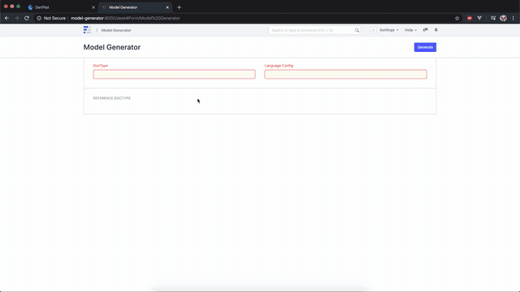

# Model Generator

Generate models to different languages based on Doctype.

## Motive

During development, the doctypes are defined usually by the backend team. Front-end development teams will require to write the models for these doctypes in the front-end as models which usually counts much as manual and repetitive task.

Since it's repetitive and somewhat an annoying task, I saw an opportunity to some extent automate this task with some minor configurations in the doctype and refactoring in the frontend which will hopefully reduce the time wasted achieving this task.

### Doctypes included

- Model Generator
- Language Model Configuration


#### Model Generator Demo



#### Language Model Configuration

A doctype to configure the templates and data types for each language. By default, there are two fixtures defined:
- Dart/Flutter
- TS/JS

Configurations include:

- **Data Type Map**. For instance, `Data` fieldtype is a `String` in Dart/Flutter.
- Variable and type template. For instance for *Dart*:
  ```
  {{fieldtype}} {{fieldname}};
  ```
  which results in:
  ```dart
  String fullName;
  ```
- **Signature Start** which indicates the beginning of the model like *class* or *interface*.
- **Signature End** which indicates the end of the model of a *class* or *interface*.
- **Child Doctype Template** which indicates the representation of a child doctype in a model. For instance in *Dart*:
   ```
   List<{{child_doctype}}>
   ```
   which results in:
   ```dart
   List<Role> roles;
   ```
- **To Camel Case** which converts the field names from the standard naming in Frappé, snake-case, to camel-case which is the convention, *Dart*, for instance.
- **Decorator (Only used if To Camel Case is checked** where this is used for languages (Dart or C#, for instance), to convert the naming between backend and frontend.

### API
In addition to utilizing this app through Frappé UI, it can also be utilized using an endpoint (`POST`). Example:
```json
{
  "cmd": "model_generator.api.generate_model",
  "lang_config": "Dart",
  "include_std_fields": 0,
  "fields": {
    "User": [
      {
        "fieldname": "enabled",
        "fieldtype": "Check"
      },
      {
        "fieldname": "email",
        "fieldtype": "Data"
      },
      {
        "fieldname": "first_name",
        "fieldtype": "Data"
      },
      {
        "fieldname": "middle_name",
        "fieldtype": "Data"
      },
      {
        "fieldname": "last_name",
        "fieldtype": "Data"
      },
      {
        "fieldname": "full_name",
        "fieldtype": "Data"
      },
      {
        "fieldname": "send_welcome_email",
        "fieldtype": "Check"
      },
      {
        "fieldname": "unsubscribed",
        "fieldtype": "Check"
      },
      {
        "fieldname": "username",
        "fieldtype": "Data"
      },
      {
        "fieldname": "language",
        "fieldtype": "Link"
      },
      {
        "fieldname": "time_zone",
        "fieldtype": "Select"
      },
      {
        "fieldname": "user_image",
        "fieldtype": "Attach Image"
      },
      {
        "fieldname": "role_profile_name",
        "fieldtype": "Link"
      },
      {
        "fieldname": "gender",
        "fieldtype": "Link"
      },
      {
        "fieldname": "phone",
        "fieldtype": "Data"
      },
      {
        "fieldname": "mobile_no",
        "fieldtype": "Data"
      },
      {
        "fieldname": "birth_date",
        "fieldtype": "Date"
      },
      {
        "fieldname": "location",
        "fieldtype": "Data"
      },
      {
        "fieldname": "banner_image",
        "fieldtype": "Attach Image"
      },
      {
        "fieldname": "interest",
        "fieldtype": "Small Text"
      },
      {
        "fieldname": "bio",
        "fieldtype": "Small Text"
      },
      {
        "fieldname": "mute_sounds",
        "fieldtype": "Check"
      },
      {
        "fieldname": "new_password",
        "fieldtype": "Password"
      },
      {
        "fieldname": "logout_all_sessions",
        "fieldtype": "Check"
      },
      {
        "fieldname": "reset_password_key",
        "fieldtype": "Data"
      },
      {
        "fieldname": "last_password_reset_date",
        "fieldtype": "Date"
      },
      {
        "fieldname": "redirect_url",
        "fieldtype": "Small Text"
      },
      {
        "fieldname": "document_follow_notify",
        "fieldtype": "Check"
      },
      {
        "fieldname": "document_follow_frequency",
        "fieldtype": "Select"
      },
      {
        "fieldname": "thread_notify",
        "fieldtype": "Check"
      },
      {
        "fieldname": "send_me_a_copy",
        "fieldtype": "Check"
      },
      {
        "fieldname": "allowed_in_mentions",
        "fieldtype": "Check"
      },
      {
        "fieldname": "email_signature",
        "fieldtype": "Small Text"
      },
      {
        "fieldname": "home_settings",
        "fieldtype": "Code"
      },
      {
        "fieldname": "simultaneous_sessions",
        "fieldtype": "Int"
      },
      {
        "fieldname": "user_type",
        "fieldtype": "Select"
      },
      {
        "fieldname": "login_after",
        "fieldtype": "Int"
      },
      {
        "fieldname": "login_before",
        "fieldtype": "Int"
      },
      {
        "fieldname": "restrict_ip",
        "fieldtype": "Data"
      },
      {
        "fieldname": "bypass_restrict_ip_check_if_2fa_enabled",
        "fieldtype": "Check"
      },
      {
        "fieldname": "last_login",
        "fieldtype": "Read Only"
      },
      {
        "fieldname": "last_ip",
        "fieldtype": "Read Only"
      },
      {
        "fieldname": "last_active",
        "fieldtype": "Datetime"
      },
      {
        "fieldname": "last_known_versions",
        "fieldtype": "Text"
      },
      {
        "fieldname": "api_key",
        "fieldtype": "Data"
      },
      {
        "fieldname": "api_secret",
        "fieldtype": "Password"
      },
      {
        "doctype": "Has Role",
        "fieldname": "roles",
        "fields": [
          {
            "fieldname": "role",
            "fieldtype": "Link"
          }
        ]
      },
      {
        "doctype": "User Email",
        "fieldname": "user_emails",
        "fields": [
          {
            "fieldname": "email_account",
            "fieldtype": "Link"
          },
          {
            "fieldname": "email_id",
            "fieldtype": "Data"
          },
          {
            "fieldname": "awaiting_password",
            "fieldtype": "Check"
          },
          {
            "fieldname": "enable_outgoing",
            "fieldtype": "Check"
          }
        ]
      },
      {
        "doctype": "Block Module",
        "fieldname": "block_modules",
        "fields": [
          {
            "fieldname": "module",
            "fieldtype": "Data"
          }
        ]
      },
      {
        "doctype": "DefaultValue",
        "fieldname": "defaults",
        "fields": [
          {
            "fieldname": "defkey",
            "fieldtype": "Data"
          },
          {
            "fieldname": "defvalue",
            "fieldtype": "Text"
          }
        ]
      },
      {
        "doctype": "User Social Login",
        "fieldname": "social_logins",
        "fields": [
          {
            "fieldname": "provider",
            "fieldtype": "Data"
          },
          {
            "fieldname": "username",
            "fieldtype": "Data"
          },
          {
            "fieldname": "userid",
            "fieldtype": "Data"
          }
        ]
      }
    ]
  }
}
```


## Contribution
Contributions in all shapes, forms and sizes are welcome :)

## License

MIT
